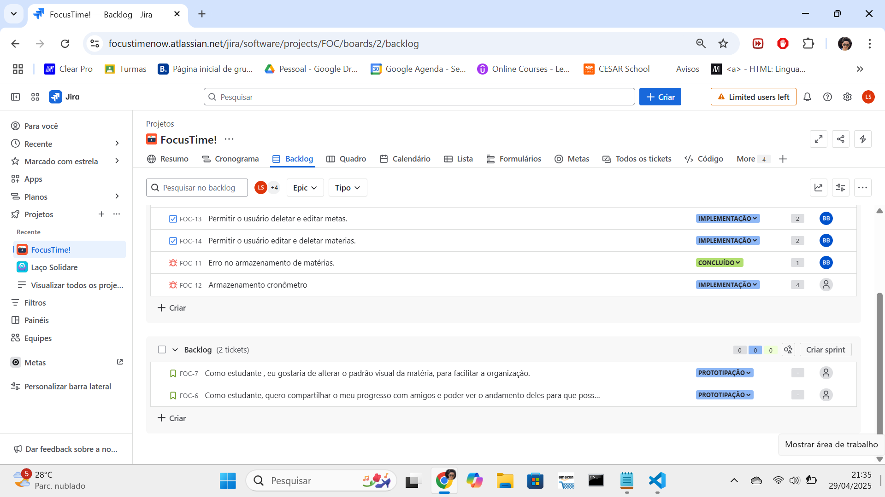
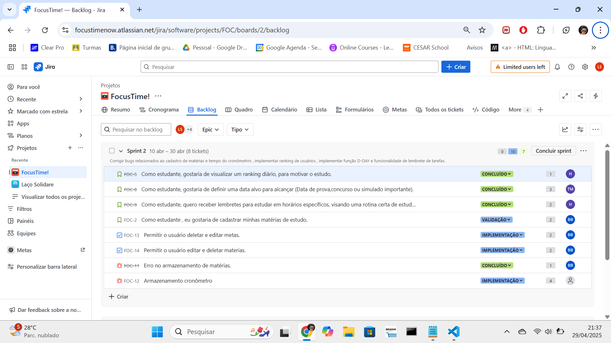
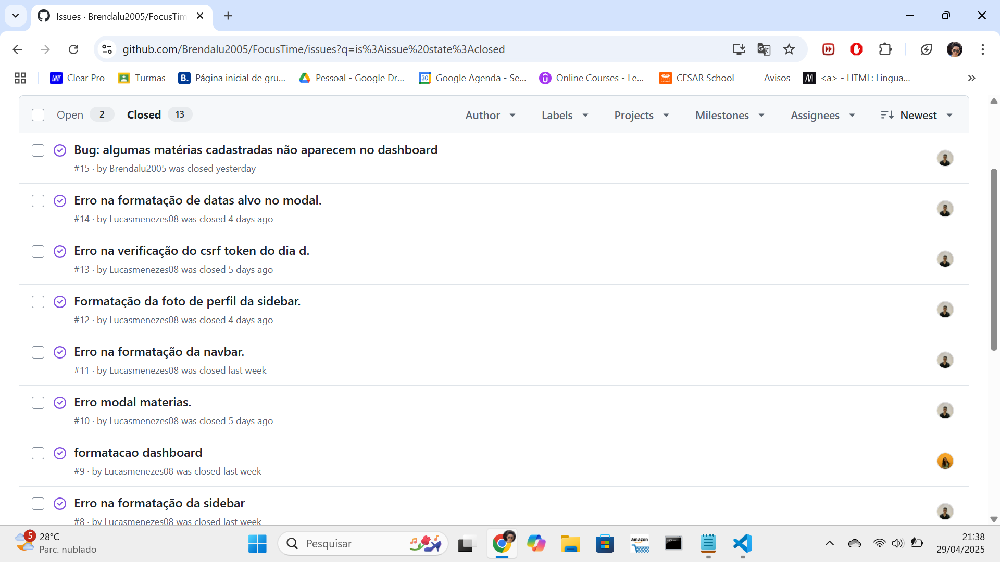
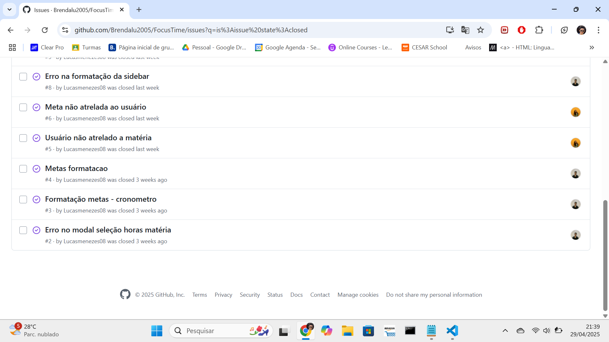

## Focustime ⏰

**Focustime** é um aplicativo projetado para ajudar você a contabilizar e organizar seu tempo de estudo de forma eficiente. Com funcionalidades como timer em tempo real, compartilhamento de progresso, metas personalizáveis e um ranking geral, o Focustime é a ferramenta ideal para estudantes que desejam maximalizar sua produtividade.
---

## Índice
-[Funcionalidades](#funcionalidades)  
-[Instalação](#Instalação)  
-[Uso](#Uso)  
-[contribuição](#Contribuição)  
-[Licença](#Licença)  
-[Tecnologias](#Tecnologias) 

---
## Funcionalidades ⚙️
- **Timer em tempo real**: Acompanhe seu tempo de estudo com um cronômetro a qualquer momento.
- **Compartilhamento de Progresso**: Compartilhe seu progresso com amigos e mantenha-se motivado.
- **Metas Personalizáveis**: Estipule metas de estudo e acompanhe seu desempenho.
- **Ranking Geral**: Veja como você está se saindo em relação a outros usuários.
- **Cadastro de Matérias**: Organize suas sessões de estudo por matérias.

---

## Primeira entrega 📄
O objetivo desta primeira entrega é fornecer uma visão inicial de como o aplicativo Focustime será visualmente e funcionalmente estruturado. Utilizando o Figma, esssa entrega permite visualizar o design e a experiência do usuário ainda como rascunho, servindo como base para o desenvolvimento completo do projeto. por mais que o trabalho não esteja finalizado, essa etapa oferece uma ideia clara de como o produto final ficará, proporcionando um direcionamento para ajustes e melhorias nas próximas fases de desenvolvimento.

<strong>Quadros e backlogs no jira</strong>

  

<strong>Links importantes ⚠️</strong>

  
- **Figma**: [Figma](https://www.figma.com/design/Zsu2h3dlnZQFJjIIsyMDmL/FocusTime?m=auto&t=hjfoeNPBILq3BWJs-6)  
- **Jira**: [Projeto no Jira](https://focustimenow.atlassian.net/jira/software/projects/FOC/summary)
- **Histórias**:[Histórias](https://docs.google.com/document/d/1lMAlUU5gH1FcrGkc81p7c0IjeVZAILIUsYVd-0jkeJw/edit?usp=sharing)
- **youtube**: [apresentação do protótipo - legendado](https://youtu.be/4_51bAq3vGY) [apresentação do protótipo - dublado](https://youtu.be/zz-bhv_pV1E)

---

## Segunda entrega 📄
O objetivo dessa segunda entrega é o começo da execução prática do projeto. Nessa fase, o foco é implementar pelo menos três histórias de usuário definidas anteriormente, com o acompanhamento detalhado no JIRA. Essa etapa consolida o trabalho inicial e prepara para as próximas iterações, aproximando o projeto da sua versão final.

<strong>Quadros e backlogs no jira</strong>

  

 

  

<strong>Links importantes ⚠️</strong>

  
- **Relatório programação em par**: [relatório programação](https://docs.google.com/document/d/1-XticSoMchm8W1HqzMP1LiDjTKTyeXXCzLYorMRl1rw/edit)
- **youtube**: [apresentação do protótipo - legendado/dublado](https://youtu.be/8OI8J7PQgNk?feature=shared)
- **site**: [Site do projeto](https://focustime.azurewebsites.net/)
- **Casos de erro**:[histórias](https://docs.google.com/document/d/1Fll4IUvsdfB777OE4EdtUfXwO-ygG_pBUts8kASELos/edit?usp=sharing)

  

---
## Terceira entrega 📄
adicionar texto

<strong>Quadros e backlogs no jira</strong>

  

 

  

<strong>Links importantes ⚠️</strong>

  
- **Relatório programação em par**: [relatório programação]()
- **youtube**: [apresentação do protótipo - legendado/dublado]()
- **site**: [Site do projeto]()
- **Casos de erro**:[histórias]()

  

---

## GRUPO 
| Aluno | email |
|-------------|---------------------|
| Brenda Bezerra  | blcb@cesar.school       |
| Heloisa Borba | hbbs@cesar.school     |
| Lucas Menezes | lms4@cesar.school    |
| Thiago Fernandes | tfm3@cesar.school |

